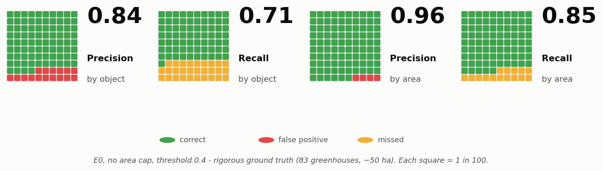
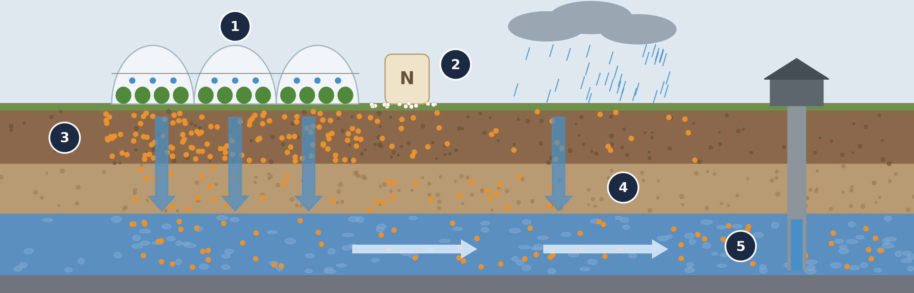
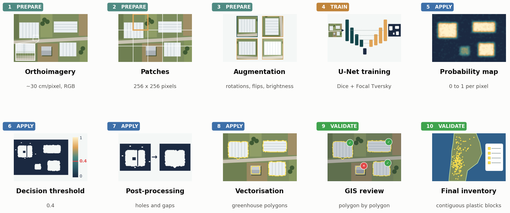
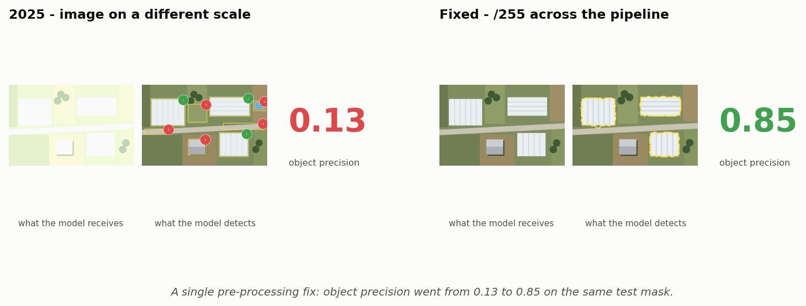
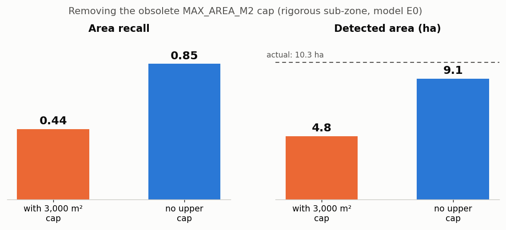
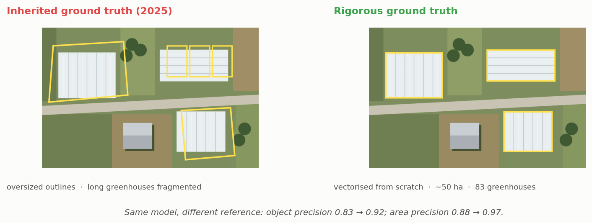
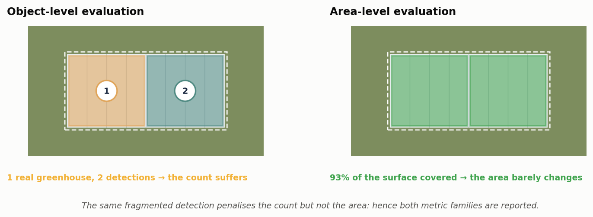
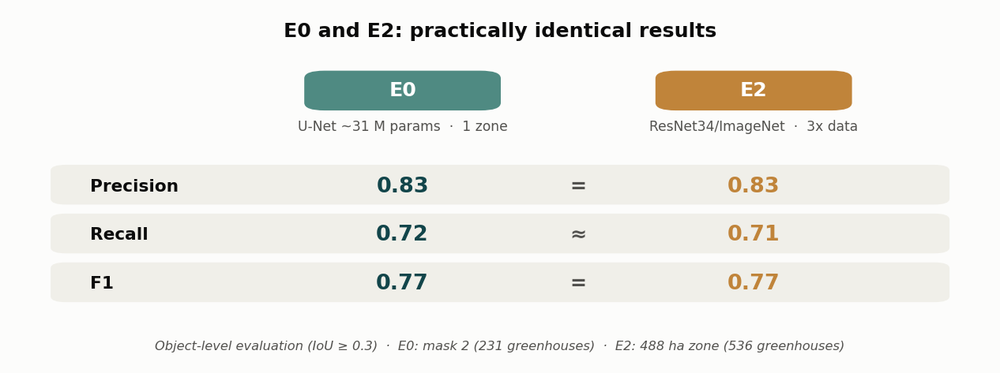

🇵🇹 **[Português](README.pt.md)**

<h1 align="center">Greenhouse detection in satellite imagery with deep learning</h1>

  <b>Semantic segmentation with U-Net</b> · Esposende – Vila do Conde Nitrate Vulnerable Zone, Portugal 
  DGT <i>ortoSat2023</i> orthoimagery · RGB · ~30 cm/pixel · ~20,000 ha

  
  
  
  

Detected greenhouse polygons (yellow) over high-resolution orthoimagery: output of the final model, after GIS validation.

> A reproducible training and detection pipeline for mapping greenhouses in a
> Nitrate Vulnerable Zone under the EU Nitrates Directive. Built on three
> principles: **error diagnosis**, **strict train/test separation** and
> **careful ground truth** — and on the habit of distrusting your own results
> until every conclusion survives critical scrutiny. The final model
> **reliably locates, counts and measures the area of greenhouses**.

---

## Headline result

Evaluated against **ground truth vectorised from scratch** (83 greenhouses in a
~50 ha sub-zone), model E0 with no maximum-area cap:

| Task | Precision | Recall | F1 |
|---|---:|---:|---:|
| **Object detection** (locate/count) | **0.84** | **0.71** | **0.77** |
| **Area coverage** (quantify) | **0.96** | **0.85** | **0.90** |

Both objectives were met. In the sub-zone, the detected area is **9.1 ha**
against **10.3 ha** on the ground. The detection unit is the **contiguous block
of plastic cover**, regardless of how many tunnels it contains — the convention
that matters for land management. Precision is the most consistent strength
(0.84 by object, 0.96 by area) and stays stable across zones: the chronic
false-positive problem of the 2025 trial is solved.

---

### Contents

[Why detect greenhouses](#why-detect-greenhouses) ·
[How the pipeline works](#how-the-pipeline-works) ·
[From 2025 to 2026](#from-2025-to-2026-the-two-bugs-that-changed-everything) ·
[Ground truth](#the-single-most-decisive-factor-ground-truth) ·
[How it is measured](#how-it-is-measured-object-and-area-answer-different-questions) ·
[Experiments](#experiments-and-results) ·
[Key takeaways](#key-takeaways) ·
[Limitations](#limitations-and-future-work) ·
[Reproduction](#reproduction-recipe-final-model)

---

## Why detect greenhouses

Intensive horticulture under plastic is one of the main sources of nitrate
contamination of aquifers in the Esposende – Vila do Conde Nitrate Vulnerable
Zone (ZV). A complete, up-to-date greenhouse inventory is simultaneously a
compliance-control instrument and a risk-mapping layer: cross-referenced with
land cover, farming practices and nitrate concentrations, it steers monitoring
and inspection towards where the pressure on groundwater is highest.

There are also grounds to suspect **significant under-reporting** of parcels
with greenhouses in the official land-parcel identification system (iSIP,
managed by IFAP). Producing a validated inventory for the whole zone, so that
this gap can be quantified, is the operational goal the model makes possible.

Manual mapping at this scale is impractical: thousands of hectares across four
municipalities, with a greenhouse stock that changes from season to season. The
task demanded automation.

---

## How the pipeline works

From orthoimagery to inventory in ten steps — the same scene is carried all the
way through, from pixel to polygon:

Four rules underpin the pipeline:

- **Pre-processing coherence** — `/255` normalisation and fixed RGB bands in
  training, validation and inference, recorded in each model's JSON metadata.
  Training and inference must never diverge.
- **Inviolable train/test separation** — spatially non-overlapping zones,
  verified geometrically. Without this, evaluation measures memorisation, not
  generalisation.
- **Rigorous ground truth** — greenhouses hand-vectorised over the orthoimagery
  to a consistent criterion; evaluation by object with IoU ≥ 0.3 and by area,
  robust to polygon fragmentation.
- **Training data prepared per batch** — 256×256 patches (greenhouse-centred, a
  complementary sliding window and hard negatives), with on-the-fly augmentation
  through a `keras.utils.Sequence` generator. Patches are kept as `uint8` and
  normalisation happens per batch, which resolved the RAM exhaustion caused by
  pre-computed augmentation on Colab.

<b>Execution environment</b>

Training on Google Colab (T4 GPU); inference and evaluation locally (CPU,
Windows 11, 32 GB RAM, no NVIDIA GPU). The 19 GB raster was clipped by mask with
LZW compression to fit within the free Google Drive quota — the full raster was
never uploaded. Reading was pinned to `src.read([1,2,3])` (RGB), discarding the
alpha channel that the WMTS service sometimes exports as a fourth band.

---

## From 2025 to 2026: the two bugs that changed everything

The 2025 trial produced too many false positives — asphalt roads, building roofs
— and required considerable manual cleanup. Instead of patching symptoms, the
2026 campaign diagnosed the causes and rebuilt the pipeline. Two bugs explain
almost everything.

### 1. Normalisation inconsistent between training and inference

Training used `/255`; inference applied a percentile contrast stretch (p2–p98).
The model received pixels on a scale it had never seen and classified entire
fields as greenhouse. **Fix:** `/255` throughout the pipeline. This change alone
raised object precision from **0.13 to 0.85** on the same test mask — the single
highest-impact factor in the whole project.

### 2. An obsolete maximum-area filter

A `MAX_AREA_M2 = 3000` cap, introduced in 2025 to contain the false-positive
blobs caused by the normalisation bug, became harmful once normalisation was
fixed: it silently removed contiguous blocks of tunnels — that is, real
large-scale greenhouses.

An initial contrast between object recall (~0.71) and area recall (~0.44)
suggested the model was locating greenhouses but covering only half their
surface. The cause lay in **post-processing, not in the model**:

| Metric | With 3,000 m² cap | No upper cap |
|---|---:|---:|
| Object recall | 0.60 | **0.71** |
| Area recall | 0.44 | **0.85** |
| Detected area (ha) | 4.77 | **9.09** |
| Object precision | 0.82 | 0.84 |
| Area precision | 0.95 | 0.96 |

Nine large greenhouses out of 83 were being rejected by the filter. Removing it
raised the detected area from 4.8 to 9.1 ha (against 10.3 ha on the ground)
**with no loss of precision** — proof that the discarded detections were
legitimate. The area deficit attributed to the model was, to a large extent, an
artefact of the filter.

---

## The single most decisive factor: ground truth

The factor that weighed most on the metrics was **not** the choice of model but
the quality of the reference. Reusing the irregular polygons inherited from 2025
inflated the ground truth and fragmented long greenhouses, penalising correct
detections as false positives.

In an intermediate evaluation (model E2, area filter still active), vectorising
rigorous ground truth from scratch raised object precision from **0.83 to 0.92**
and area precision from **0.88 to 0.97** — confirming that most of the apparent
"false positives" were in fact correct detections. These figures isolate the
effect of ground truth; the reference result is the E0 run without the area cap,
reported above.

---

## How it is measured: object and area answer different questions

A fragmented detection heavily penalises the count and barely affects the area.
Both metric families are therefore reported: **object-level** evaluation
(matching at IoU ≥ 0.3) answers "where are they and how many"; **area-level**
evaluation answers "how much surface do they occupy" — the variable that matters
for estimating nitrogen pressure.

---

## Experiments and results

Two models were trained and compared:

- **E0 — retrained baseline:** U-Net (~31 M parameters), combined loss
  (0.7·Dice + 0.3·Focal Tversky), Adam `lr=5e-4`, a single training zone.
  `val_dice ≈ 0.94`.
- **E2 — pre-trained encoder, recall-oriented:** U-Net with a **ResNet34**
  encoder (ImageNet), recall-oriented loss and **multi-zone** training (~3× more
  data than E0).

Object-level evaluation (IoU ≥ 0.3):

| Run | Test zone | GT | Precision | Recall | F1 | Note |
|---|---|---:|---:|---:|---:|---|
| 2025 baseline | mask 1 | 33 | 0.13 | 0.76 | 0.23 | before the fix |
| E0 (no filter, threshold 0.4) | mask 1 | 33 | 0.85 | 0.88 | 0.87 | small sample |
| E0 | mask 2 | 231 | 0.83 | 0.72 | 0.77 | intermediate, area cap active |
| E2 (multi-zone) | 488 ha | 536 | 0.83 | 0.71 | 0.77 | intermediate, area cap active |
| **E0: reference** | **rigorous sub-zone** | **83** | **0.84** | **0.71** | **0.77** | **final, no upper cap** |

> The intermediate runs were evaluated with the area cap still active; the final
> reference figure (E0, rigorous sub-zone, no cap) is the one in the headline
> result. Object F1 stays stable (~0.77) across the representative zones.
> Removing the cap mainly improved **area recall** (0.44 → 0.85), not the
> object-level metrics.

Main observations:

- Coherent `/255` normalisation raised precision from **0.13 to 0.85**.
- The larger zones (231 and 536 greenhouses) give the most reliable object-level
  figure: **F1 ≈ 0.77**.
- **E0 ≈ E2**: a pre-trained encoder and three times the data did not improve F1.

<b>Approaches tested and rejected</b> — documenting what did not work is also a result

- **Confidence-threshold tuning:** probabilities are bimodal; tuning had little
  effect.
- **Geometric anti-road filter:** rejected 16 real greenhouses — narrow tunnels
  are geometrically identical to road segments, while the main false positives
  (building roofs) were *more* compact than greenhouses. It was disabled: the
  false-positive problem is spectral, not geometric.
- **Deeper/pre-trained architecture (E2):** no F1 improvement over E0.
- **Three times more training data (multi-zone):** no F1 improvement.
- **Morphological post-processing** (hole filling and closing): no effect on
  area, because by that point the upstream area cap had already removed the large
  greenhouses — no downstream operation could recover them. With the cap removed,
  area recall rose to ~0.85 with no morphology needed.

---

## Key takeaways

1. **Data hygiene paid off more than architecture:** coherent normalisation,
   strict train/test separation and quality ground truth.
2. **Auditing inherited post-processing is essential.** A single obsolete
   parameter silently affected every intermediate metric and almost led to a
   wrong scientific conclusion — "area is irreducibly underestimated". It was
   not.
3. **Ground-truth quality dominated** every modelling choice.
4. **Architecture and data volume are not always the decisive variable:** E0 ≈ E2,
   and three times the data produced the same F1.

---

## Limitations and future work

**Limitations**

- The most reliable metrics rest on 231–536 greenhouses in the larger zones and
  83 greenhouses in the rigorous sub-zone.
- Area recall (0.85) was measured only in the rigorous sub-zone and should be
  reproduced in another zone.
- A single image source and epoch was used (*ortoSat2023*); temporal and
  cross-sensor generalisation was not assessed.

**Future work**

- Extend the rigorous ground truth to several sub-zones and at least 300
  greenhouses, reproducing the area metric in a second sub-zone.
- Explore higher-resolution or multispectral imagery, to probe the physical limit
  of the spectral signature of plastic.

---

## Reproduction recipe (final model)

<b>Full parameters</b>

- **Imagery:** *ortoSat2023* (DGT), RGB, ~30 cm/pixel, EPSG:3763
- **Normalisation:** `/255` in training **and** inference
- **Patch:** 256×256; sliding-window stride 192 (patch − 64)
- **Inference threshold:** 0.4
- **Filters:** geometric **disabled**; area **minimum 40 m², no upper cap** (the
  3,000 m² cap removed contiguous blocks of tunnels)
- **E0:** U-Net ~31 M parameters, loss 0.7·Dice + 0.3·FocalTversky(0.3/0.5/1.33),
  Adam 5e-4, batch 8, early stopping on `val_dice`
- **E2:** U-Net + ResNet34 (ImageNet), Tversky(0.6/0.4), Adam 1e-4
- **Evaluation:** by object (IoU ≥ 0.3) and by area; ground truth clipped to the
  mask
- **Detection unit:** contiguous block of plastic cover

**Reference result** (E0, rigorous sub-zone, 83 greenhouses, ~50 ha, no area
cap): object precision 0.84 · recall 0.71 · F1 0.77 — area precision 0.96 ·
recall 0.85 · F1 0.90.

---

## Tech stack

`Python` · `TensorFlow/Keras` · `segmentation-models` · `rasterio` · `GeoPandas` ·
`OpenCV` · `Shapely` · `scikit-learn` · DGT *ortoSat2023* orthoimagery (open WMS,
Direção-Geral do Território)

## About the data and the model

The imagery belongs to the open high-resolution orthoimagery service
**ortoSat2023** of the Direção-Geral do Território (DGT), used with due
attribution. The ground-truth polygons, the trained model weights and the
detection results are institutional property of CCDR-Norte, I.P. and are not
published in this repository. The code is shared as a working reference
implementation of the complete training and detection pipeline.

> The schematic figures in this README illustrate the method over a drawn
> landscape, not over real data; the institutional orthoimagery and polygons are
> not disclosed.

---

  <b>Luís Filipe Pacheco</b> · Senior Engineer and Data Scientist, CCDR-Norte, I.P. 
  <a href="https://github.com/LFilipePacheco">GitHub</a> ·
  <a href="https://www.linkedin.com/in/lu%C3%ADs-filipe-pacheco-471495b/">LinkedIn</a> ·
  <a href="https://orcid.org/0009-0001-7676-6542">ORCID</a>

