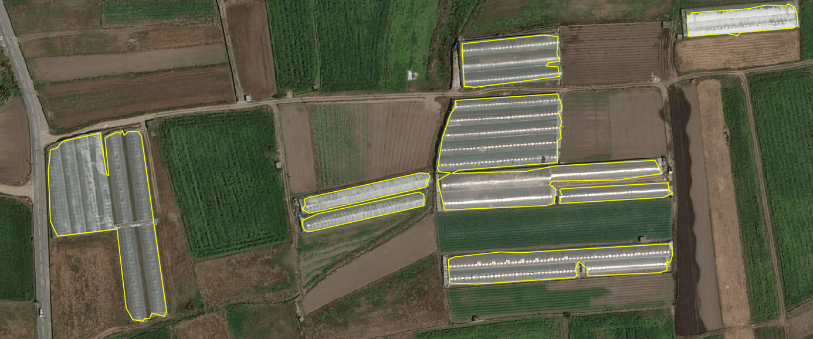

# Greenhouse detection from satellite imagery with deep learning
### U-Net semantic segmentation · Esposende – Vila do Conde Vulnerable Zone, Portugal

> A reproducible train-and-detect pipeline that maps greenhouse structures
> across a Nitrates Directive Vulnerable Zone (~20,000 ha) from high-resolution
> satellite orthoimagery (DGT *ortoSat2023*, RGB, ~30 cm/pixel). Built around
> bug diagnosis, strict train/test separation and rigorous ground truth — and
> around a habit of distrusting its own results until each conclusion survives
> scrutiny. The final model reliably **locates, counts and measures the area**
> of greenhouses.

---

*Detected greenhouse polygons (yellow) over high-resolution orthoimagery — final model output after GIS validation.*

## Headline result

Evaluated against **rigorously digitised ground truth** (83 greenhouses over a
~50 ha sub-zone), model E0, with no maximum-area cap:

| Task | Precision | Recall | F1 |
|---|---:|---:|---:|
| **Object detection** (location / count) | **0.84** | **0.71** | **0.77** |
| **Area coverage** | **0.96** | **0.85** | **0.90** |

Both objectives are met: the model is reliable for **locating and counting**
greenhouses *and* for **estimating the area** they occupy. Detected area on the
sub-zone is 9.1 ha against 10.3 ha real. The detection unit is defined as the
**contiguous block of plastic covering**, regardless of how many individual
tunnels it contains — the convention that matters for land-management purposes.

Precision is the robust strong point — 0.84 by object, 0.96 by area, stable
across zones. The historical false-positive problem of the 2025 pilot is
resolved.

## Why detect greenhouses

Intensive horticulture under plastic is one of the main sources of aquifer
contamination by nitrates in the Esposende – Vila do Conde Vulnerable Zone
(*Zona Vulnerável*, ZV). A complete, up-to-date greenhouse layer is both a
compliance instrument and a risk-mapping input: crossed with land use, farming
practices and nitrate concentrations, it lets the monitoring authority target
enforcement where pressure on groundwater is highest.

There are also grounds to suspect substantial under-registration of greenhouse
parcels in the official land-parcel system (iSIP, managed by IFAP). Producing a
**validated, zone-wide census** to quantify that gap is the operational goal the
model now makes possible, once inference is scaled to all 19 processing masks
(see *Future work*).

Manual mapping at this scale is impractical — thousands of hectares across three
municipalities, with greenhouse stock changing season to season. The task called
for automation.

## From 2025 to 2026 — what changed

The 2025 pilot produced too many false positives (asphalt roads, rooftops),
requiring extensive manual cleaning. Rather than patch it, the 2026 campaign
diagnosed the root causes and rebuilt the pipeline. Four defects were found, in
order of impact:

1. **Inconsistent normalisation between training and inference** — the dominant
   cause of false positives. Training normalised by `/255`; inference stretched
   contrast with percentiles (p2–p98), so the model saw pixels on a different
   scale and classified whole fields as greenhouse. **Fix:** `/255` throughout.
   This single change moved object precision from **0.13 → 0.85** on the test
   mask.
2. **Row/column swap** — `rasterio ... index(x, y)` returns `(row, col)`; the
   code unpacked `(col, row)`, transposing the read window.
3. **Bounding box instead of polygon** — prediction covered the mask's bounding
   box (e.g. 701 ha) rather than the true polygon (e.g. 474 ha), generating
   detections outside the area of interest. **Fix:** rasterise the polygon and
   null the exterior.
4. **Obsolete maximum-area filter** — a `MAX_AREA_M2 = 3000` cap, introduced in
   2025 to contain the false-positive blobs the normalisation bug produced. Once
   normalisation was fixed, this cap became harmful: it silently deleted
   contiguous tunnel blocks (real large greenhouses). Removing it raised area
   recall **0.44 → 0.85** (see below). This bug quietly contaminated every
   intermediate evaluation until it was caught.

Reading was also fixed to `src.read([1,2,3])` (RGB), discarding the alpha
channel the WMTS service sometimes exports as a fourth band.

## Method (corrected pipeline)

**Golden rule — preprocessing coherence.** `/255` normalisation and fixed RGB
bands in training, validation and inference, recorded in per-model JSON
metadata. Training and inference must never diverge.

**Inviolable train/test separation.** Training and test zones with no spatial
overlap (geometrically verified). Without this, evaluation measures memorisation,
not generalisation.

**Rigorous ground truth.** Greenhouses digitised manually over the orthophoto
with a consistent criterion. Object-level evaluation at IoU ≥ 0.3; area-level
evaluation robust to polygon fragmentation.

**Training data preparation.** 256×256 patches: (a) centred on greenhouses,
(b) complementary sliding window, (c) hard negatives. On-the-fly augmentation via
a `keras.utils.Sequence` generator (patches kept as `uint8`; normalisation and
augmentation per batch) — solving the RAM exhaustion that pre-computed
augmentation caused on Colab.

**Execution environment.** Training on Google Colab (T4 GPU); inference and
evaluation locally (CPU, Windows 11, 32 GB RAM, no NVIDIA GPU). The 19 GB raster
was clipped to each mask (LZW compression) to stay within the free Google Drive
limit — the full raster was never uploaded.

## Experiments and results

Two models were trained and compared:

- **E0 (retrained baseline)** — U-Net (~31 M parameters), combined loss
  (0.7·Dice + 0.3·Focal Tversky), Adam `lr=5e-4`, single training zone.
  `val_dice ≈ 0.94`.
- **E2 (pretrained encoder, recall-oriented)** — U-Net with an ImageNet-
  pretrained **ResNet34** encoder, recall-oriented loss, **multi-zone** training
  (~3× the data of E0).

Object-level evaluation (IoU ≥ 0.3), journey to resolving false positives:

| Run | Test zone | GT greenhouses | Precision | Recall | F1 |
|---|---|---:|---:|---:|---:|
| Baseline 2025 (with post-proc.) | mask 1 | 33 | 0.13 | 0.76 | 0.23 |
| E0 (no filter, thr 0.4) | mask 1 | 33 | 0.85 | 0.88 | 0.87 |
| E0 (no filter) | mask 2 | 231 | 0.83 | 0.72 | 0.77 |
| E2 (multi-zone) | 488 ha zone | 536 | 0.83 | 0.71 | 0.77 |

Key observations:

- Coherent `/255` normalisation drove precision from **0.13 → 0.85**.
- The larger zones (231 and 536 greenhouses) give the reliable object figure:
  **F1 ≈ 0.77**.
- **E0 ≈ E2**: a pretrained encoder plus 3× the data did **not** improve F1.

### The area filter — a self-correction

An early contrast between object recall (~0.71) and area recall (~0.44) suggested
the model located greenhouses but covered only half their surface. The cause
turned out to be **post-processing, not the model**: the obsolete `MAX_AREA_M2`
cap was deleting every detection above 3,000 m² — precisely the contiguous tunnel
blocks that are large real greenhouses.

Re-quantified on the rigorous sub-zone (E0, cap vs. no cap):

| Metric | With 3,000 m² cap | No cap |
|---|---:|---:|
| Object recall | 0.60 | **0.71** |
| Area recall | 0.44 | **0.85** |
| Detected area (ha) | 4.77 | **9.09** |
| Object precision | 0.82 | 0.84 |
| Area precision | 0.95 | 0.96 |

Nine large greenhouses (of 83) were being rejected by the filter. Removing it
raised detected area from 4.8 to 9.1 ha (real: 10.3 ha) **with no loss of
precision** — proof they were legitimate detections. The area shortfall
previously attributed to the model was largely a **filter artefact**.

### The role of ground-truth quality

The single most determinant factor in the metrics was **not** any model choice —
it was ground-truth quality. Reusing irregular polygons inherited from the 2025
detection inflated the reference and fragmented long greenhouses, penalising
correct detections as false positives. In an intermediate evaluation (model E2,
area filter still active), digitising rigorous ground truth from scratch raised
object precision **0.83 → 0.92** and area precision **0.88 → 0.97**, confirming
that most apparent "false positives" were in fact correct detections. These
figures isolate the ground-truth effect; the final reference result is the E0,
no-cap figure reported in the headline.

## What was tested and rejected

Documenting the dead ends is part of the result:

- **Confidence threshold** — probabilities are bimodal; tuning had little effect.
- **Geometric anti-road filter** — rejected 16 real greenhouses (narrow tunnels
  are geometrically identical to road segments) while the dominant false
  positives (rooftops) were *more* compact than greenhouses. Turned off; the
  false-positive problem is spectral, not geometric.
- **Deeper / pretrained architecture (E2)** — no F1 gain over E0.
- **3× more training data (multi-zone)** — no F1 gain.
- **Morphological post-processing** (hole filling + closing) — no effect on area,
  because at the time of that test the area cap upstream had already removed the
  large greenhouses; nothing downstream could recover them. Once the cap was
  removed, area recall rose to ~0.85 with no morphology needed.

## Key lessons

- The biggest gains came from **data hygiene**, not sophisticated architecture:
  coherent normalisation, strict train/test separation, rigorous ground truth.
- **Audit inherited post-processing.** A single obsolete parameter silently
  contaminated every intermediate metric and nearly produced a wrong scientific
  conclusion ("area is irreducibly underestimated"). It was not.
- **Ground-truth quality dominated** every modelling choice.
- Architecture and data volume are not always the lever: E0 ≈ E2, and 3× the
  data gave the same F1.

## Limitations

- The reliable metrics rest on 231–536 greenhouses (larger zones) and 83 in the
  rigorous sub-zone; the rigorous sub-zone (~50 ha) is small and should be
  enlarged to consolidate paper-grade figures.
- Area recall (0.85) was measured only on the rigorous sub-zone; it should be
  replicated on another.
- Inter-annotator agreement on the definition of "greenhouse" was not formally
  measured.
- A single image source and epoch (*ortoSat2023*); temporal and cross-sensor
  generalisation not assessed.
- File-version management was a recurrent source of error (same-named masks with
  different areas). Versioned naming and systematic area/overlap checks are
  recommended.

## Future work

- Scale the model to all the ZV (~20,000 ha) for a **validated, zone-wide
  greenhouse census** — the basis for a defensible under-registration figure
  against the iSIP-IFAP registry (~15–25 min per mask on CPU).
- Enlarge rigorous ground truth (several sub-zones, ≥300 greenhouses) and
  replicate the area metric on a second sub-zone.
- Inter-annotator agreement study on the "greenhouse" definition.
- Explore higher-resolution or multispectral imagery for the physical limit of
  the plastic signature.

## Repository contents

| File | Purpose |
|---|---|
| `deteta_estufas_DL_completo_v2.py` | Local inference (sliding window) with all four fixes and the (switchable) geometric filter. **Recommended:** threshold 0.4, geometric filter off, no max-area cap |
| `treino_estufas_colab_comentado.py` | **Reference** training pipeline (E0): U-Net, RAM-constant augmentation generator, integrated inference and evaluation, annotated |
| `treino_estufas_E2_colab.py` | E2 variant: pretrained ResNet34 encoder, recall-oriented loss, multi-zone |
| `recortar_fase0.py` | Clips the orthophoto to training/test masks (LZW) |
| `avaliar_detecao.py` | Object-level evaluation (IoU ≥ 0.3); TP/FP/FN diagnostic layers |
| `avaliar_por_area.py` | Area-level evaluation, robust to polygon fragmentation |
| `pos_processar_e_avaliar.py` | Decoupled post-processing: shape metrics, calibratable filters, threshold search |
| `posproc_morfologico.py` | Hole filling + morphological closing + dissolve, with area re-evaluation |
| `requirements.txt` | Python dependencies |

Each trained model is paired with a JSON metadata file (normalisation, bands,
threshold, loss, seed, metrics). Paths and parameters live in the configuration
section of each script — point them at your own imagery, ground truth and output
folder.

## Reproduction recipe (final model)

- Imagery: *ortoSat2023* (DGT), RGB, ~30 cm/pixel, EPSG:3763
- Normalisation: `/255` (training **and** inference)
- Patch 256×256; sliding-window stride 192 (patch − 64)
- Inference threshold: **0.4**
- Geometric filter: **off**; area filter: **min 40 m², no maximum cap** (the
  3,000 m² cap cut contiguous tunnel blocks)
- E0: U-Net ~31 M params, loss 0.7·Dice + 0.3·FocalTversky(0.3/0.5/1.33), Adam
  5e-4, batch 8, early stopping on `val_dice`
- E2: U-Net + ResNet34 (ImageNet), Tversky(0.6/0.4), Adam 1e-4
- Evaluation: object (IoU ≥ 0.3) and area; ground truth clipped to the mask
- Detection unit: contiguous block of plastic covering

**Reference result (E0, rigorous sub-zone, 83 greenhouses, ~50 ha, no area cap):**
object P=0.84 R=0.71 F1=0.77 · area P=0.96 R=0.85 F1=0.90.

## Stack

Python · TensorFlow/Keras · segmentation-models · rasterio · GeoPandas · OpenCV ·
Shapely · scikit-learn · DGT *ortoSat2023* orthoimagery (open WMS, Direção-Geral
do Território)

## About the data and the model

The imagery is the open **ortoSat2023** high-resolution orthoimagery service of
the Direção-Geral do Território (DGT), used with attribution. The ground-truth
polygons, trained model weights and detection results are institutional property
of CCDR-Norte, I.P. and are not published here. The code is shared as a working
reference implementation of the full train-and-detect pipeline.

---

**Luís Filipe Pacheco** — Senior Engineer & Data Scientist,
CCDR-Norte, I.P. · [GitHub profile](https://github.com/LFilipePacheco) ·
[LinkedIn](https://www.linkedin.com/in/lu%C3%ADs-filipe-pacheco-471495b/) ·
[ORCID](https://orcid.org/0009-0001-7676-6542)
