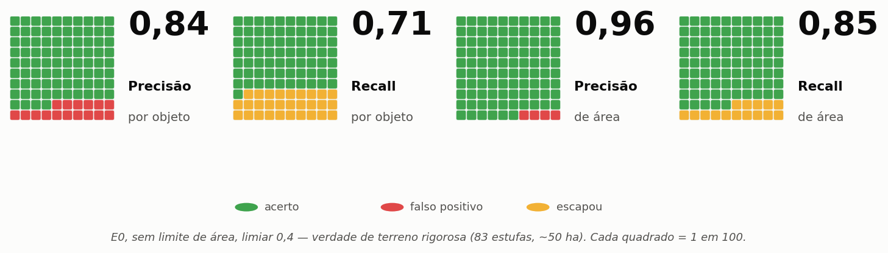
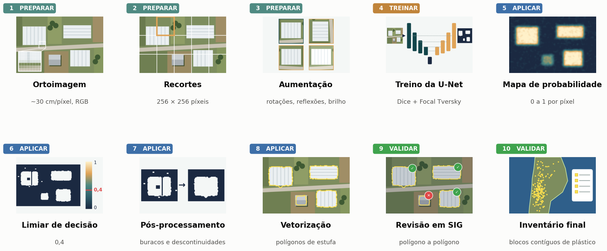
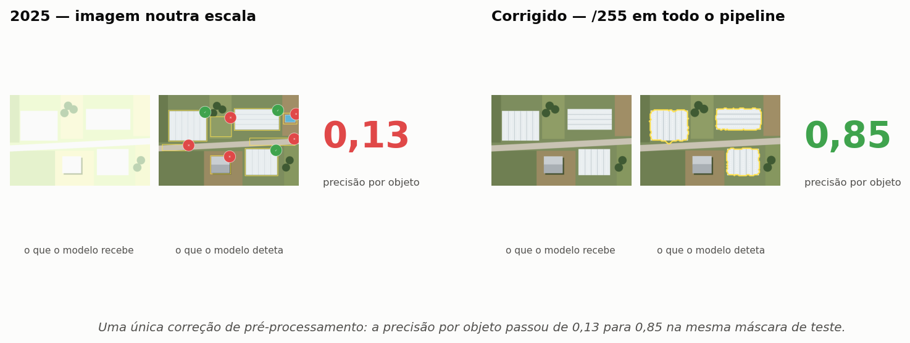
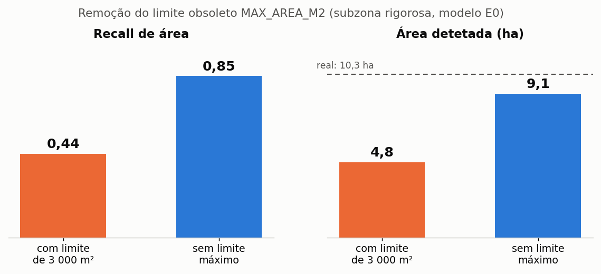
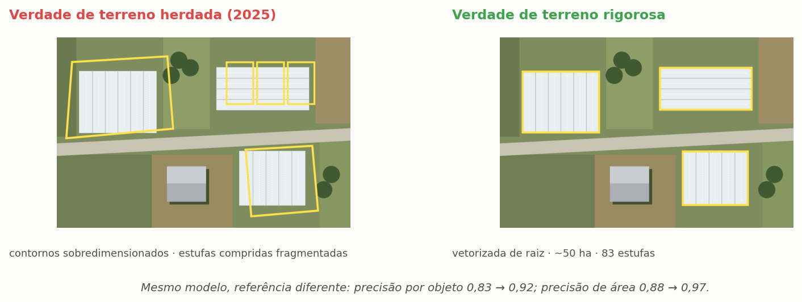
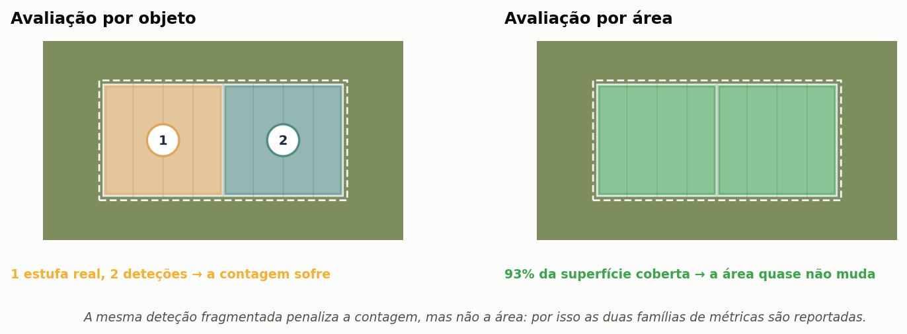
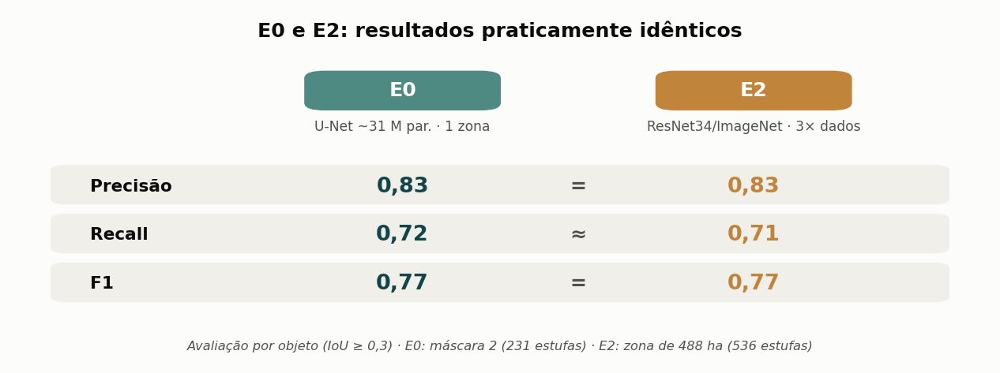

🇬🇧 **[English](README.md)**

<h1 align="center">Deteção de estufas em imagens de satélite com aprendizagem profunda</h1>

  <b>Segmentação semântica com U-Net</b> · Zona Vulnerável de Esposende – Vila do Conde, Portugal 
  Ortoimagens DGT <i>ortoSat2023</i> · RGB · ~30 cm/píxel · ~20 000 ha

  
  
  
  

Polígonos de estufas detetadas (amarelo) sobre ortoimagem de alta resolução: resultado do modelo final, após validação em SIG.

> Pipeline reprodutível de treino e deteção para cartografar estufas numa Zona
> Vulnerável ao abrigo da Diretiva Nitratos. Construído sobre três princípios:
> **diagnóstico de erros**, **separação rigorosa entre treino e teste** e
> **verdade de terreno criteriosa** — e sobre o hábito de desconfiar dos próprios
> resultados até cada conclusão resistir a uma análise crítica. O modelo final
> **localiza, contabiliza e mede de forma fiável a área das estufas**.

---

## Resultado principal

Avaliação sobre **verdade de terreno vetorizada de raiz** (83 estufas numa subzona
de ~50 ha), modelo E0 sem limite máximo de área:

| Tarefa | Precisão | Recall | F1 |
|---|---:|---:|---:|
| **Deteção por objeto** (localizar/contar) | **0,84** | **0,71** | **0,77** |
| **Cobertura de área** (quantificar) | **0,96** | **0,85** | **0,90** |

Ambos os objetivos foram atingidos. Na subzona, a área detetada é de **9,1 ha**
face a **10,3 ha** reais. A unidade de deteção é o **bloco contíguo de cobertura
plástica**, independentemente do número de túneis que contenha — a convenção
relevante para gestão do território. A precisão é o ponto forte mais consistente
(0,84 por objeto, 0,96 por área) e mantém-se estável entre zonas: o problema
histórico de falsos positivos do ensaio de 2025 está resolvido.

---

### Índice

[Porquê detetar estufas](#porquê-detetar-estufas) ·
[Como funciona](#como-funciona-o-pipeline) ·
[De 2025 a 2026](#de-2025-a-2026-os-dois-erros-que-mudaram-tudo) ·
[Verdade de terreno](#o-fator-mais-determinante-a-verdade-de-terreno) ·
[Como se mede](#como-se-mede-objeto-e-área-respondem-a-perguntas-diferentes) ·
[Experiências](#experiências-e-resultados) ·
[Conclusões](#principais-conclusões) ·
[Limitações](#limitações-e-trabalho-futuro) ·
[Reprodução](#receita-de-reprodução-modelo-final)

---

## Porquê detetar estufas

A horticultura intensiva sob plástico é uma das principais fontes de contaminação
dos aquíferos por nitratos na Zona Vulnerável de Esposende – Vila do Conde (ZV).
Um inventário completo e atualizado de estufas é, ao mesmo tempo, instrumento de
controlo do cumprimento das normas e elemento de cartografia do risco: cruzado
com a ocupação do solo, as práticas agrícolas e as concentrações de nitratos,
orienta a monitorização e a fiscalização para onde a pressão sobre as águas
subterrâneas é mais elevada.

Há ainda razões para suspeitar de um **sub-registo significativo** das parcelas
com estufas no sistema oficial de identificação parcelar (iSIP, gerido pelo IFAP).
Produzir um inventário validado para toda a zona, que permita quantificar essa
diferença, é o objetivo operacional que o modelo torna possível.

A cartografia manual a esta escala é impraticável: milhares de hectares em quatro
municípios, com um parque de estufas que muda de campanha para campanha. A tarefa
exigia automatização.

---

## Como funciona o pipeline

Da ortoimagem ao inventário, em dez etapas — as mesmas imagens seguem todo o
percurso, do píxel ao polígono:

Quatro regras sustentam o pipeline:

- **Coerência de pré-processamento** — normalização `/255` e bandas RGB fixas no
  treino, na validação e na inferência, registadas em metadados JSON de cada
  modelo. Treino e inferência nunca podem divergir.
- **Separação inviolável treino/teste** — zonas sem sobreposição espacial,
  verificada geometricamente. Sem isso, a avaliação mede memorização, não
  generalização.
- **Verdade de terreno rigorosa** — estufas vetorizadas à mão sobre a ortoimagem
  segundo critério consistente; avaliação por objeto com IoU ≥ 0,3 e por área,
  robusta à fragmentação dos polígonos.
- **Dados de treino preparados por lote** — patches de 256×256 (centrados em
  estufas, janela deslizante complementar e negativos difíceis), com aumento de
  dados em tempo real através de um gerador `keras.utils.Sequence`. Os patches
  ficam em `uint8` e a normalização faz-se por lote, o que resolveu o esgotamento
  de RAM causado pelo aumento de dados pré-calculado no Colab.

<b>Ambiente de execução</b>

Treino no Google Colab (GPU T4); inferência e avaliação localmente (CPU, Windows 11,
32 GB de RAM, sem GPU NVIDIA). O raster de 19 GB foi recortado por máscara, com
compressão LZW, para respeitar o limite da versão gratuita do Google Drive — o
raster completo nunca foi carregado. A leitura foi fixada em `src.read([1,2,3])`
(RGB), descartando o canal alfa que o serviço WMTS exporta por vezes como quarta
banda.

---

## De 2025 a 2026: os dois erros que mudaram tudo

O ensaio de 2025 produzia demasiados falsos positivos — estradas asfaltadas,
coberturas de edifícios — e exigia uma limpeza manual considerável. Em vez de
correções pontuais, a campanha de 2026 diagnosticou as causas e reconstruiu o
pipeline. Dois erros explicam quase tudo.

### 1. Normalização inconsistente entre treino e inferência

O treino usava `/255`; a inferência aplicava um estiramento de contraste por
percentis (p2–p98). O modelo recebia píxeis numa escala que nunca tinha visto e
classificava campos inteiros como estufa. **Correção:** `/255` em todo o pipeline.
Só esta alteração elevou a precisão por objeto de **0,13 para 0,85** na mesma
máscara de teste — o fator isolado de maior impacto em todo o trabalho.

### 2. Filtro obsoleto de área máxima

Um limite `MAX_AREA_M2 = 3000`, introduzido em 2025 para conter as manchas de
falsos positivos causadas pelo erro de normalização, tornou-se prejudicial depois
de a normalização estar corrigida: eliminava silenciosamente blocos contíguos de
túneis — ou seja, estufas reais de grande dimensão.

Um contraste inicial entre recall por objeto (~0,71) e recall de área (~0,44)
sugeria que o modelo localizava as estufas mas cobria apenas metade da sua
superfície. A causa estava no **pós-processamento, não no modelo**:

| Métrica | Com limite de 3 000 m² | Sem limite máximo |
|---|---:|---:|
| Recall por objeto | 0,60 | **0,71** |
| Recall de área | 0,44 | **0,85** |
| Área detetada (ha) | 4,77 | **9,09** |
| Precisão por objeto | 0,82 | 0,84 |
| Precisão de área | 0,95 | 0,96 |

Nove estufas de grande dimensão, em 83, estavam a ser rejeitadas pelo filtro. A
sua remoção aumentou a área detetada de 4,8 para 9,1 ha (face a 10,3 ha reais),
**sem perda de precisão** — prova de que as deteções eliminadas eram legítimas. O
défice de área atribuído ao modelo era, em grande medida, um artefacto do filtro.

---

## O fator mais determinante: a verdade de terreno

O fator com maior peso nas métricas **não** foi a escolha do modelo, mas a
qualidade da referência. Reutilizar os polígonos irregulares herdados de 2025
inflacionava a verdade de terreno e fragmentava estufas compridas, penalizando
deteções corretas como falsos positivos.

Numa avaliação intermédia (modelo E2, ainda com o filtro de área ativo), vetorizar
uma verdade de terreno rigorosa de raiz elevou a precisão por objeto de **0,83
para 0,92** e a precisão de área de **0,88 para 0,97** — confirmando que a maioria
dos aparentes «falsos positivos» eram, na realidade, deteções corretas. Estes
valores isolam o efeito da verdade de terreno; o resultado de referência é o do E0
sem limite máximo, apresentado acima.

---

## Como se mede: objeto e área respondem a perguntas diferentes

Uma deteção fragmentada penaliza fortemente a contagem e quase não afeta a área.
Por isso são reportadas as duas famílias de métricas: a avaliação **por objeto**
(emparelhamento com IoU ≥ 0,3) responde a «onde estão e quantas são»; a avaliação
**por área** responde a «que superfície ocupam» — a variável que interessa para
estimar a pressão azotada.

---

## Experiências e resultados

Foram treinados e comparados dois modelos:

- **E0 — referência retreinada:** U-Net (~31 M de parâmetros), perda combinada
  (0,7·Dice + 0,3·Focal Tversky), Adam `lr=5e-4`, uma única zona de treino.
  `val_dice ≈ 0,94`.
- **E2 — encoder pré-treinado, orientado ao recall:** U-Net com encoder
  **ResNet34** (ImageNet), perda orientada ao recall e treino **multizona**
  (~3× mais dados do que o E0).

Avaliação por objeto (IoU ≥ 0,3):

| Execução | Zona de teste | GT | Precisão | Recall | F1 | Nota |
|---|---|---:|---:|---:|---:|---|
| Referência 2025 | máscara 1 | 33 | 0,13 | 0,76 | 0,23 | antes da correção |
| E0 (sem filtro, limiar 0,4) | máscara 1 | 33 | 0,85 | 0,88 | 0,87 | amostra pequena |
| E0 | máscara 2 | 231 | 0,83 | 0,72 | 0,77 | intermédio, limite de área ativo |
| E2 (multizona) | 488 ha | 536 | 0,83 | 0,71 | 0,77 | intermédio, limite de área ativo |
| **E0: referência** | **subzona rigorosa** | **83** | **0,84** | **0,71** | **0,77** | **final, sem limite máximo** |

> As execuções intermédias foram avaliadas com o limite de área ainda ativo; o
> valor final de referência (E0, subzona rigorosa, sem limite) é o apresentado no
> resultado principal. O F1 por objeto mantém-se estável (~0,77) nas zonas
> representativas. A remoção do limite melhorou sobretudo o **recall de área**
> (0,44 → 0,85), e não as métricas por objeto.

Observações principais:

- A normalização coerente por `/255` elevou a precisão de **0,13 para 0,85**.
- As zonas maiores (231 e 536 estufas) dão o valor mais fiável por objeto:
  **F1 ≈ 0,77**.
- **E0 ≈ E2**: um encoder pré-treinado e três vezes mais dados não melhoraram o F1.

<b>Abordagens testadas e rejeitadas</b> — documentar o que não resultou também é resultado

- **Ajuste do limiar de confiança:** as probabilidades são bimodais; o ajuste teve
  pouco efeito.
- **Filtro geométrico anti-estrada:** rejeitou 16 estufas reais — os túneis
  estreitos são geometricamente idênticos a troços de estrada, ao passo que os
  principais falsos positivos (coberturas de edifícios) eram *mais* compactos do
  que as estufas. Foi desativado: o problema dos falsos positivos é espectral, não
  geométrico.
- **Arquitetura mais profunda/pré-treinada (E2):** sem melhoria de F1 face ao E0.
- **Três vezes mais dados de treino (multizona):** sem melhoria de F1.
- **Pós-processamento morfológico** (preenchimento de buracos e fecho): sem efeito
  na área, porque nessa altura o limite de área a montante já tinha eliminado as
  estufas grandes — nenhuma operação a jusante as poderia recuperar. Removido o
  limite, o recall de área subiu para ~0,85 sem necessidade de morfologia.

---

## Principais conclusões

1. **A higiene dos dados rendeu mais do que a arquitetura:** normalização
   coerente, separação rigorosa treino/teste e verdade de terreno de qualidade.
2. **É essencial auditar o pós-processamento herdado.** Um único parâmetro
   obsoleto afetou silenciosamente todas as métricas intermédias e quase conduziu
   a uma conclusão científica errada — «a área é irredutivelmente subestimada».
   Não era.
3. **A qualidade da verdade de terreno dominou** todas as escolhas de modelação.
4. **Arquitetura e volume de dados nem sempre são a variável decisiva:** E0 ≈ E2,
   e três vezes mais dados produziram o mesmo F1.

---

## Limitações e trabalho futuro

**Limitações**

- As métricas mais fiáveis assentam em 231–536 estufas nas zonas maiores e em 83
  estufas na subzona rigorosa.
- O recall de área (0,85) foi medido apenas na subzona rigorosa e deve ser
  reproduzido noutra zona.
- Foi usada uma única fonte e época de imagem (*ortoSat2023*); a generalização
  temporal e entre sensores não foi avaliada.

**Trabalho futuro**

- Alargar a verdade de terreno rigorosa a várias subzonas e pelo menos 300
  estufas, reproduzindo a métrica de área numa segunda subzona.
- Explorar imagens de maior resolução ou multiespectrais, para avaliar o limite
  físico da assinatura espectral do plástico.

---

## Receita de reprodução (modelo final)

<b>Parâmetros completos</b>

- **Imagens:** *ortoSat2023* (DGT), RGB, ~30 cm/píxel, EPSG:3763
- **Normalização:** `/255` no treino **e** na inferência
- **Patch:** 256×256; passo da janela deslizante 192 (patch − 64)
- **Limiar de inferência:** 0,4
- **Filtros:** geométrico **desativado**; área **mínima de 40 m², sem limite
  máximo** (o limite de 3 000 m² eliminava blocos contíguos de túneis)
- **E0:** U-Net ~31 M parâmetros, perda 0,7·Dice + 0,3·FocalTversky(0,3/0,5/1,33),
  Adam 5e-4, lote 8, paragem antecipada por `val_dice`
- **E2:** U-Net + ResNet34 (ImageNet), Tversky(0,6/0,4), Adam 1e-4
- **Avaliação:** por objeto (IoU ≥ 0,3) e por área; verdade de terreno recortada
  pela máscara
- **Unidade de deteção:** bloco contíguo de cobertura plástica

**Resultado de referência** (E0, subzona rigorosa, 83 estufas, ~50 ha, sem limite
de área): precisão por objeto 0,84 · recall 0,71 · F1 0,77 — precisão de área 0,96 ·
recall 0,85 · F1 0,90.

---

## Tecnologias utilizadas

`Python` · `TensorFlow/Keras` · `segmentation-models` · `rasterio` · `GeoPandas` ·
`OpenCV` · `Shapely` · `scikit-learn` · ortoimagens DGT *ortoSat2023* (WMS aberto,
Direção-Geral do Território)

## Sobre os dados e o modelo

As imagens pertencem ao serviço aberto de ortoimagens de alta resolução
**ortoSat2023**, da Direção-Geral do Território (DGT), usado com a devida
atribuição. Os polígonos de verdade de terreno, os pesos dos modelos treinados e
os resultados das deteções são propriedade institucional da CCDR-Norte, I.P. e não
são publicados neste repositório. O código é partilhado como implementação de
referência funcional do pipeline completo de treino e deteção.

> As figuras esquemáticas deste README ilustram o método sobre uma paisagem
> desenhada, não sobre dados reais; as ortoimagens e os polígonos institucionais
> não são divulgados.

---

  <b>Luís Filipe Pacheco</b> · Engenheiro Sénior e Cientista de Dados, CCDR-Norte, I.P. 
  <a href="https://github.com/LFilipePacheco">GitHub</a> ·
  <a href="https://www.linkedin.com/in/lu%C3%ADs-filipe-pacheco-471495b/">LinkedIn</a> ·
  <a href="https://orcid.org/0009-0001-7676-6542">ORCID</a>

